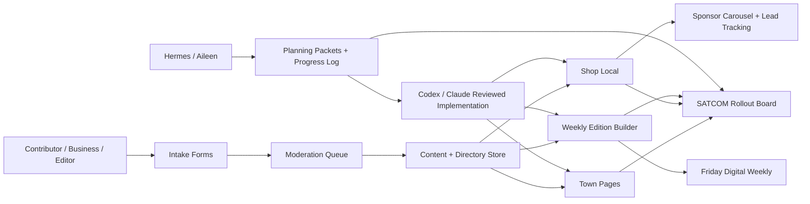

# CoNews.Press Architecture Optimization

Status: optimized buildout plan
Generated: 2026-05-14
Scope: CoNews.Press, city sites, Shop Local, weekly editions, SATCOM, Hermes/Aileen, Codex/Claude

## Architecture Goal

Build one repeatable hyperlocal publishing system instead of one-off town websites. Each town gets its own public front door, but the content model, Shop Local directory, campaign kits, weekly edition flow, and SATCOM operations board stay shared.

## Canonical Split

| Layer | Purpose | Canonical Surface | Owner Lane |
|---|---|---|---|
| Public Network | reader-facing town and activity sites | `*.conews.press`, selected property domains like `redrocks.press` | Codex/Claude after review |
| Public Brand Properties | existing canonical brands | `5280.menu`, `redrocks.press`, activity domains | Codex/Claude after review |
| Operations / SATCOM | admin, ownership board, rollout progress, staff handoff | CoPress/SATCOM dashboard | Codex/Claude execution |
| Planning / Agent Lane | packets, issue exports, editorial plans, safe suggestions | Hermes/Aileen + `/Users/Ace/workspace/02_Output/` | Hermes/Aileen planning |
| Execution / Review Lane | code edits, commits, PRs, deploy verification | `/Users/Ace/Codex` | Codex/Claude |

Do not treat `5280.menu` and `conews.press` as interchangeable. Use `5280.menu` where it is the canonical public site for that property. Use `conews.press` as the network and operations identity for town/activity rollout unless source-of-truth docs say otherwise.

## Optimized System Flow



## Four-Layer Build Architecture

### 1. Public Presentation Layer

Surfaces:
- town sites: `morrison.conews.press`, `nederland.conews.press`, etc.
- activity sites: `gambling.conews.press`, `rafting.conews.press`, etc.
- property sites: `redrocks.press`, `5280.menu`

Responsibilities:
- SEO pages
- article pages
- town landing pages
- Shop Local directory views
- weekly edition pages
- contributor and advertiser CTA surfaces

Optimization:
- Use one town-page template fed by town metadata.
- Use one activity-page template fed by activity metadata.
- Keep property domains as canonical when they already have brand gravity.

### 2. Shared Data / Content Layer

Core entities:
- `Town`
- `Activity`
- `Article`
- `Author`
- `BusinessListing`
- `SponsorPlacement`
- `Event`
- `WeeklyEdition`
- `ContributorSubmission`
- `CampaignKit`

Optimization:
- One schema per entity.
- Town/activity pages only filter and render data.
- Sponsored content is metadata, not a separate content type.
- Every public item has `canonical_url`, `status`, `review_state`, and `last_verified_at`.

### 3. Workflow / SATCOM Layer

SATCOM should show:
- rollout board
- thumbnails
- town status
- packet links
- blockers
- next action
- owner lane
- deploy readiness
- recent progress log

Optimization:
- SATCOM is the visibility layer, not the source of truth for secrets or production state.
- SATCOM can mirror safe packet files from `/Users/Ace/workspace/02_Output/`.
- Keep a visible `blocked/planning/build/verify/live` state for every site.

### 4. Agent / Execution Layer

Hermes/Aileen:
- planning
- packet generation
- issue exports
- editorial/sponsor briefs
- file-based progress logs
- MCP suggest-mode when hooks are healthy

Codex/Claude:
- repo reads
- code patches
- commits
- PRs
- deploys
- live verification

Optimization:
- Hermes never becomes the raw shell.
- Hermes sends reviewed implementation requests to Codex/Claude.
- MCP action handoff remains disabled until `~/bin/mcp-status` is green.

## Recommended Data Contracts

### Town

```json
{
  "slug": "morrison",
  "name": "Morrison",
  "canonical_host": "morrison.conews.press",
  "property_host": "redrocks.press",
  "phase": "pilot",
  "status": "planning",
  "editorial_lead": "Paul Hill",
  "commerce_lead": "Joathon Weisneth",
  "primary_pillars": ["events", "music", "visitor-guide", "shop-local"],
  "thumbnail": "",
  "blocker": "verify Morrison business seed list",
  "next_action": "create first weekly edition sample"
}
```

### BusinessListing

```json
{
  "business_name": "",
  "town": "",
  "category": "",
  "tier": "free",
  "verification_status": "needs_verification",
  "canonical_url": "",
  "phone": "",
  "website": "",
  "tracking_slug": "",
  "sponsor_start": null,
  "sponsor_end": null
}
```

### WeeklyEdition

```json
{
  "edition_id": "morrison-2026-05-15",
  "town": "morrison",
  "publish_window": "friday_morning",
  "front_page_story": "",
  "followups": [],
  "shop_local_spotlight": "",
  "sports_events_slot": "",
  "calendar_notices": [],
  "sponsor_placements": [],
  "status": "draft"
}
```

## Optimized PR Sequence

1. `feat(satcom): add conews rollout ownership board`
   - visible progress first
   - uses static packet links and town metadata
   - no backend dependency

2. `feat(data): add conews town and activity metadata`
   - one data source for town cards and activity cards
   - feeds public pages and SATCOM

3. `feat(shoplocal): add directory schema and sponsor tier exports`
   - schema first, UI second
   - avoids inventing fields per town

4. `feat(editorial): add SEO pillar templates`
   - shared templates for town content
   - keeps articles consistent without sounding generic

5. `feat(weekly): add sample digital edition renderer`
   - static/sample payload first
   - no live email

6. `feat(intake): add contributor and advertiser onboarding CTAs`
   - reviewed links only
   - upload CTA near top of relevant pages

7. `chore(mcp): repair guarded Ops MCP monitoring`
   - separate from public-site work
   - only after buildout artifacts are stable

## Decisions To Lock

- Keep `hermes3-8b` as stable Hermes default.
- Use Qwen safe alias only for heavy planning/curation.
- Keep `conews.press` network architecture separate from `5280.menu` canonical property pages.
- Make SATCOM the visual owner board before deeper wiring.
- Use file progress hooks until MCP status is green.
- Never use raw Hermes shell for production operations.

## Immediate Next Action

Build the SATCOM ownership board from this optimized data shape, using the eight first rollout sites and packet links already generated.

